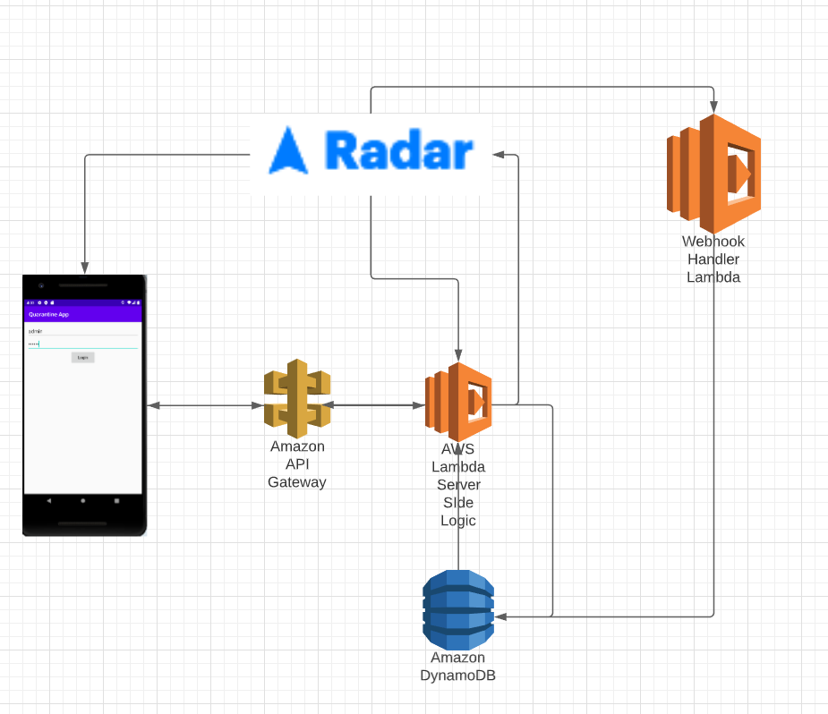
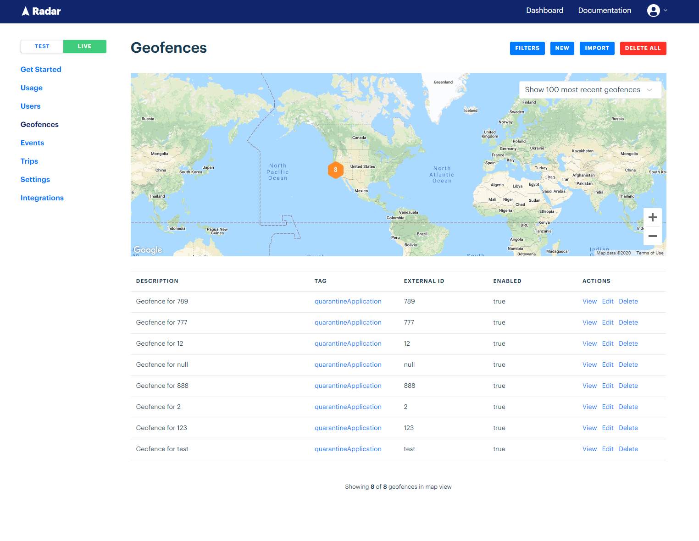
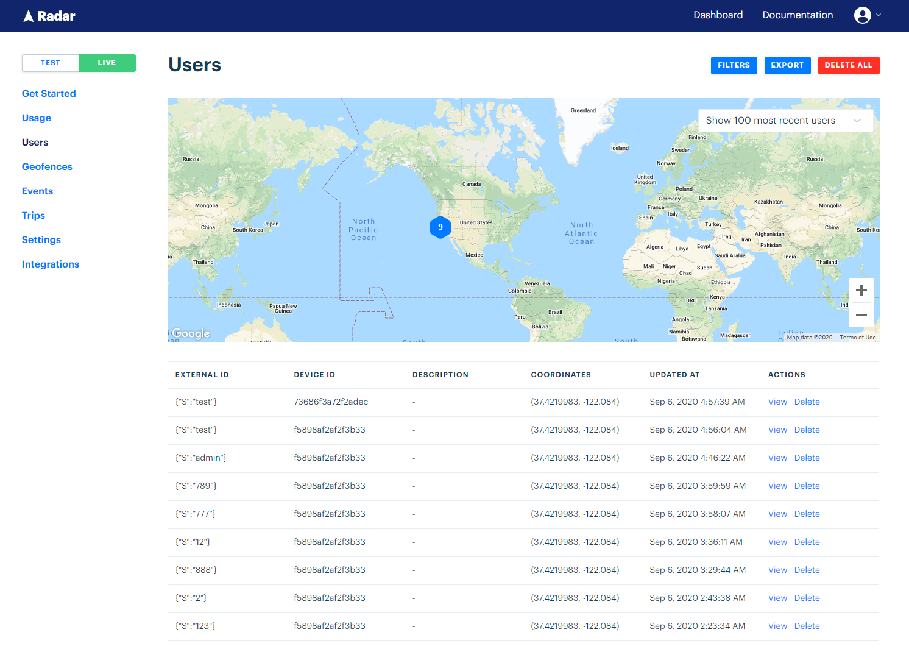

# QuarantineApplicationHackathon
The purpose of the application to enforce Quarantine Guidelines. For example, the city of New York has a mandatory 14 day quarantine, but they don’t have a good way to enforce their policy. They could leverage this application to monitor travelers and ensure that they are staying within their quarantine facilities and or places of residence. 

The application heavily leverages Radar.io to track users and create a geofence that will ensure that users do not leave their place of residence.

## Usage of Radar.io
* Used in order to get User's current location
* Used to continuously Track the User in the background
* Generate the Geofence that will ensure users stay within their Quarantine Zone
* Utilized Radar.io Webhook integration which notifies of Users leaving their geofence which in term means breaking Quarantine Guidelines w

## Architecture Diagram

## Radar.io usage

## Backend
[Backend Repository](https://github.com/Rayjk123/quarantine-application-hackathon-backend)

